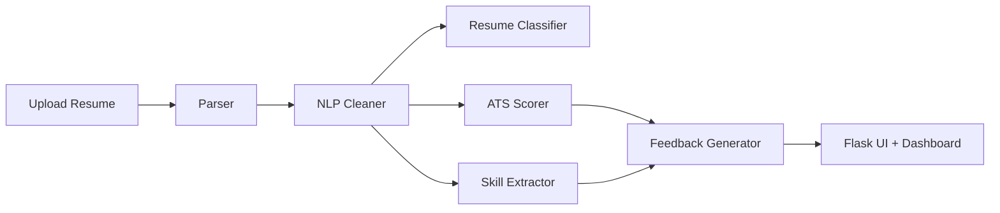

# AI Career Intelligence Platform

AI-powered resume analyzer and career coach for multiple domains including IT, Mechanical, Civil, Biomedical, Finance, and Marketing.

## Features

- Resume upload for PDF and DOCX
- Job description analysis
- ATS compatibility scoring
- Career category prediction
- Missing skill detection
- Rule-based career feedback
- Interview question generation
- Authentication and analysis history

## Architecture



## Installation

1. Create and activate a virtual environment.
2. Install dependencies with `pip install -r requirements.txt`.
3. Ensure the SQLite database folder exists.

## Train Models

Run:

```bash
python ml_models/resume_classifier/train.py
```

This prints accuracy, precision, recall, and F1 score, then saves the selected model and vectorizer with joblib.

## Run the App

```bash
python app.py
```

Open the local Flask server and register a user before running protected dashboard features.

## Deploy On Render (Recommended)

This repository is ready for Render using Gunicorn and [render.yaml](render.yaml).

1. Push this project to GitHub.
2. In Render, click **New +** -> **Blueprint**.
3. Connect your GitHub repo and select this project.
4. Render will read [render.yaml](render.yaml) and create:
   - A web service
   - A managed PostgreSQL database
5. After the first deploy, set your `SECRET_KEY` environment variable in the Render dashboard.

### Environment Variables

- `DATABASE_URL` is automatically connected from the Render PostgreSQL service.
- `SECRET_KEY` must be set manually to a strong random string.

### Notes

- The app uses PostgreSQL in production.
- `uploads` are stored in `/tmp/uploads` in production, which is ephemeral.

## Screenshots

Add home, dashboard, and results screenshots here after first deployment.

## Future Improvements

- Ollama-based feedback generation
- Multi-page resume parsing improvements
- Better skill ontology and domain tagging
- User-uploaded job description history
- Model retraining dashboard