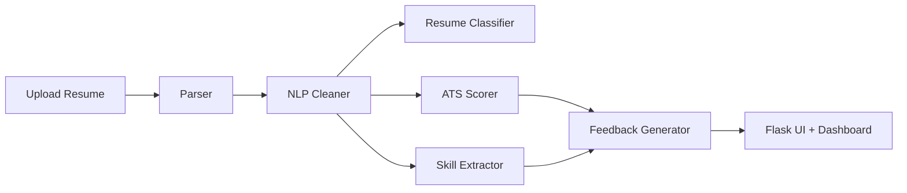

# AI Career Intelligence Platform

AI-powered resume analyzer and career coach for multiple domains including IT, Mechanical, Civil, Biomedical, Finance, and Marketing.

## Features

- Resume upload for PDF and DOCX
- Job description analysis
- ATS compatibility scoring
- Career category prediction
- Missing skill detection
- Rule-based career feedback
- Interview question generation
- Authentication and analysis history

## Architecture



## Installation

1. Create and activate a virtual environment.
2. Install dependencies with `pip install -r requirements.txt`.
3. Ensure the SQLite database folder exists.

## Train Models

Run:

```bash
python ml_models/resume_classifier/train.py
```

This prints accuracy, precision, recall, and F1 score, then saves the selected model and vectorizer with joblib.

## Run the App

```bash
python app.py
```

Open the local Flask server and register a user before running protected dashboard features.

## Deploy On Google Cloud Run

1. Install and initialize the Google Cloud CLI.
2. Provision Cloud SQL for PostgreSQL and the runtime service account:

```powershell
.\setup-cloud-sql.ps1
```

This creates a local [cloudsql-settings.ps1](cloudsql-settings.ps1) file with the generated password, connection details, and service account email. Do not commit that file.

3. Set your project:

```bash
gcloud config set project YOUR_PROJECT_ID
```

4. Enable required APIs:

```bash
gcloud services enable run.googleapis.com cloudbuild.googleapis.com artifactregistry.googleapis.com sqladmin.googleapis.com
```

5. Build and deploy from the project root:

```bash
gcloud run deploy ai-career-intelligence-platform \
    --source . \
    --region us-central1 \
    --allow-unauthenticated \
    --service-account ai-career-runner@YOUR_PROJECT_ID.iam.gserviceaccount.com \
    --add-cloudsql-instances YOUR_PROJECT:us-central1:YOUR_INSTANCE \
    --set-env-vars SECRET_KEY=your-secret-key,DB_NAME=your_db_name,DB_USER=your_db_user,DB_PASSWORD=your_db_password,CLOUD_SQL_CONNECTION_NAME=YOUR_PROJECT:us-central1:YOUR_INSTANCE
```

6. After deployment, Cloud Run will give you a public URL.

For persistent data in production, use Cloud SQL for PostgreSQL and pass the instance connection name plus database credentials as shown above. If you already prefer a fully formed connection string, you can set `DATABASE_URL` directly and the app will use it.

### Windows PowerShell helper

You can also run the deployment script in the project root after provisioning Cloud SQL:

```powershell
.\deploy-cloud-run.ps1
```

If [cloudsql-settings.ps1](cloudsql-settings.ps1) exists, the deploy script uses it automatically.

## Screenshots

Add home, dashboard, and results screenshots here after first deployment.

## Future Improvements

- Ollama-based feedback generation
- Multi-page resume parsing improvements
- Better skill ontology and domain tagging
- User-uploaded job description history
- Model retraining dashboard